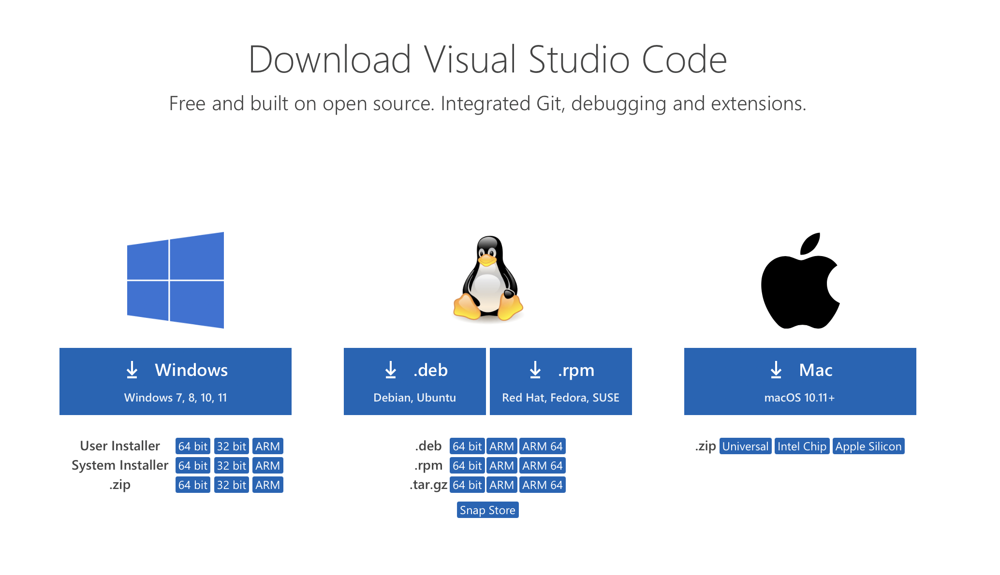

# Lab Report 1

Steps for logging into a course-specific account on ieng6:
1. download and install VScode
*  This can be done by going to the [link](https://code.visualstudio.com/download) here for downloading VScode
* From there, once you've downloaded it, drag it from downloads into the applications folder and then open it up from applications.
 Here is the site to download it. From here, I clicked the download for macOS because I have a Mac.
