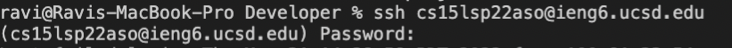
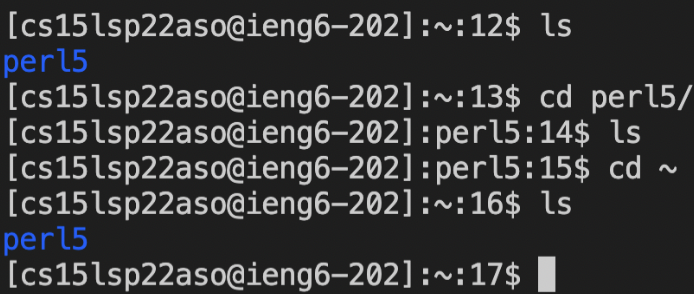

# Lab Report 1

Steps for logging into a course-specific account on ieng6:
### 1. Download and install VScode
*  This can be done by going to the [link](https://code.visualstudio.com/download) here for downloading VScode
* From there, once you've downloaded it, drag it from downloads into the applications folder and then open it up from applications.
 Here is the site to download it. From here, I clicked the download for macOS because I have a Mac.

### 2. Connect remotely with ssh
* First, look up your specific account for the course [here](https://sdacs.ucsd.edu/~icc/index.php)
* Next, open up the terminal in VScode and type in the command `ssh cs15lsp22zz@ieng6.ucsd.edu` but replace 'zz' with the letters in your course specific account. For me, that was 'aso'.
* If it's your first time connecting to the server, there will be a note in terminal saying that the authenticity of the server cannot be established and it will ask if you want to continue connecting. Just say yes to this, and then you will have to type in your passcode.
* From then on, any time you login, it should look something like this to login:  The first time, however, you will have that message you have to approve first.

### 3. Running commands
* From there, any commands you run in the terminal will now be run on the remote computer. So, if we try some commands, like `ls` or `cd`, it will not be referring to the files and directories on your computer, it will be in reference to the ones on the remote computer.  

* Notice the path shows that it is coming from cs15l, not my home computer. Then, running a few commands, we can interact with the directories and files on that remote computer.

### 4. Moving files with scp
