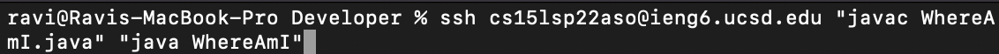

# Lab Report 1

Steps for logging into a course-specific account on ieng6:
### 1. Download and install VScode
*  This can be done by going to the [link](https://code.visualstudio.com/download) here for downloading VScode
* From there, once you've downloaded it, drag it from downloads into the applications folder and then open it up from applications.
 Here is the site to download it. From here, I clicked the download for macOS because I have a Mac.

### 2. Connect remotely with ssh
* First, look up your specific account for the course [here](https://sdacs.ucsd.edu/~icc/index.php)
* Next, open up the terminal in VScode and type in the command `ssh cs15lsp22zz@ieng6.ucsd.edu` but replace 'zz' with the letters in your course specific account. For me, that was 'aso'.
* If it's your first time connecting to the server, there will be a note in terminal saying that the authenticity of the server cannot be established and it will ask if you want to continue connecting. Just say yes to this, and then you will have to type in your passcode.
* From then on, any time you login, it should look something like this to login:  The first time, however, you will have that message you have to approve first.

### 3. Running commands
* From there, any commands you run in the terminal will now be run on the remote computer. So, if we try some commands, like `ls` or `cd`, it will not be referring to the files and directories on your computer, it will be in reference to the ones on the remote computer.  

* Notice the path shows that it is coming from cs15L, not my home computer. Then, running a few commands, we can interact with the directories and files on that remote computer.

### 4. Moving files with scp
* Next, let's try copying a file from the home/client computer to the remote computer. 
* Either create a new file on the client computer or choose an existing one.
* Then, in the directory where this file is made on your computer, run the command, `scp <fileName> cs15lsp22zz@ieng6.ucsd.edu:~/` but once again, changing zz to the class account letters and replacing <fileName> with the name of the file including the .java or whatever filetype it is. You will be prompted to enter in the password again, and once you do that, it should work.
* Running this command on my computer referencing the file WhereAmI.java, you can see I went through the same process and I am currently in the directory on the client side. 
* Then, once I login again with ssh and look around, you can see that the file WhereAmI.java got copied over to the server. 

### 5. Setting an SSH Key
* Currently, every time we try to login or use scp, we have to retype out or password. This can be solved with the use of ssh keys.
* In order to set this up, on your computer first run `ssh-keygen` It will ask you to input a passphrase or hit enter for none. Since we don't want to retype out a pasword every time, hit enter. Hit it once more to confirm. 
* Then, it will give a randomart key. You can ignore this. This process creates two files on your computer: a public key (id_rsa.pub) and a private one (id_rsa) in a .ssh folder.
* From there, login to the server once more and create a ".ssh" folder using `ssh` to login like before and then `mkdir .ssh` to create the folder. Logout once more. 
* Once you're back on the client terminal, run the command `scp /Users/<user-name>/.ssh/id_rsa.pub cs15lsp22zz@ieng6.ucsd.edu:~/.ssh/authorized_keys` to copy over the public key to the server. Again, replace <user-name> with your user and zz with the class acount letters.
*After it's all done, it should work without having to sign in every time. As a result of running ssh to login again after all this is done, it should respond with something similar to this: 

Notice that there is no prompt to input the password this time.

### 6. Optimizing Remote Running
* Using the knowledge that we can add commands in quotes to the end of an ssh command to login and then run those commands, we can further optimize this process. If we first use our scp command like before to copy a new file over to the server from the client, for example, WhereAmI.java, then we use ssh and add commands at the end to run it, the whole thing will only take two commands and no in between steps like inputting the password, since we have fixed that problem. 
* So, after using `scp WhereAmI.java cs15lsp22zz@ieng6.ucsd.edu:~/` to copy over the file (replacing zz). Then, run the following command to login and run the file. 

* Once this is done, it should login, compile and run the program!