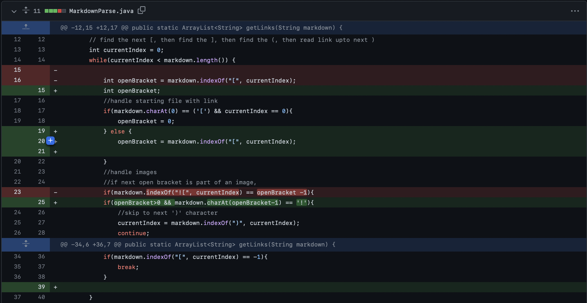

[Home](../index.md)

# Lab Report 2

### Bugs and Fixes:

1. Bug: Empty line at end of code causes a forever loop

Code change: 

Test file that caused the error: [test2.md](https://github.com/ravishende/markdown-parser/blob/main/test2.md?plain=1)
Note: if you look at the file in the view in github desktop, it appears that there isn’t an empty line at the end, but that is just github hiding it. If you were to edit the file in github (or fork the repo), you will see that there is indeed a third, empty line that is just not shown by github’s public view of the file, probably because generally empty lines at the end of code don’t matter, so github doesn’t usually need to show it.

Symptom of bug (output of test): 

The bug is caused by the code forever searching for more open brackets, only ending if there is a closing parenthesis as the final character. However, if this is not the case, it will be stuck in the loop never ending, always waiting for another open bracket (until the terminal terminates the program because it is out of memory). This failure inducing input of the file with an empty line at the end causes this forever loop by doing exactly what was just described: not ending the file with a ')'.

2. Bug: Images addresses are printed as links

Code change: 

Test file that caused the error: [test3.md](https://github.com/ravishende/markdown-parser/blob/main/test3.md?plain=1)
Symptom of bug (output of test): 

This bug is caused by images and links having very similar characteristics in .md files. They are both in the form of "", just with images having an "!" at the end. This causes the code to pick out image addresses as links and then print those out alongside the normal links. Thus, having a file with links in it as well as images cuases this symptom.

3. Bug: Links at the start of files are not printed

Code change: 

Test file that caused the error: [test4.md](https://github.com/ravishende/markdown-parser/blob/main/test4.md?plain=1)
Symptom of bug (output of test): 

The relationship between the bug, the symptom, and the failure inducing input 
My fix for the images caused there to be a new bug of links at the start of files not being printed. This is because it first checks if there is an open bracket at the beginning of the code. Then if it is, it will set the value of openBracket equal to zero. Later, the line `if(markdown.indexOf("![", currentIndex) == openBracket -1){` is true in this case becaue ther is no image in the file, meaning the .indexOf() method returns -1. But, the index of openBracket is 0, and 0-1 is -1, so they are the same, so it skips the link and continues to the next. Thus, the failure inducing input file having a link at the beginning and no images will cause this bug.