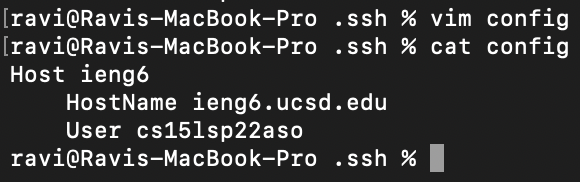
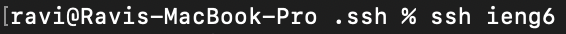
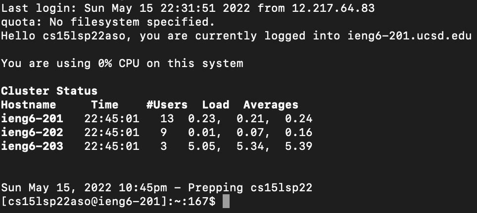
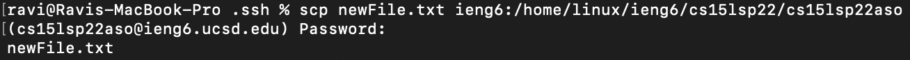
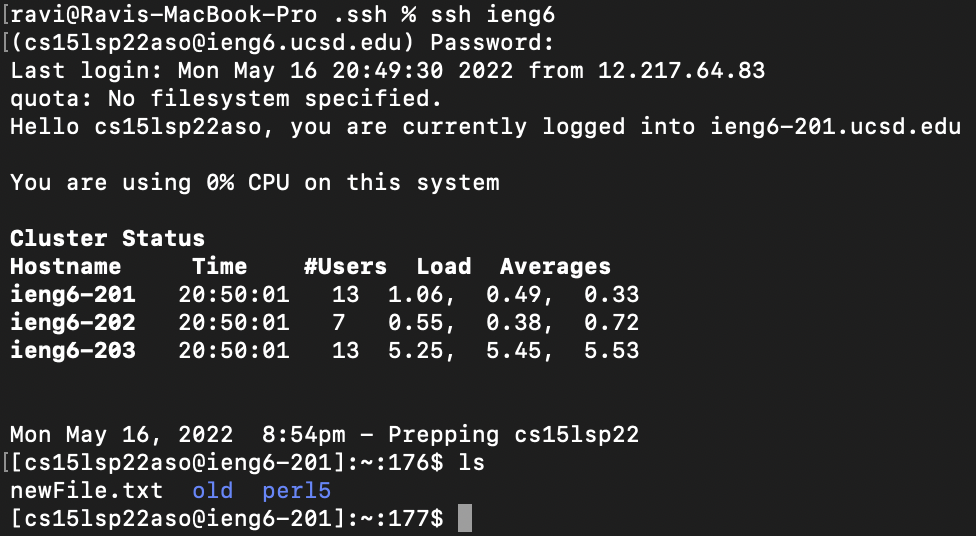
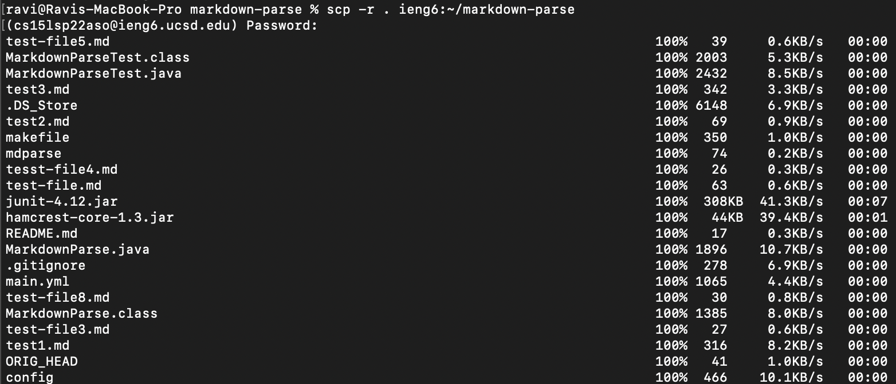
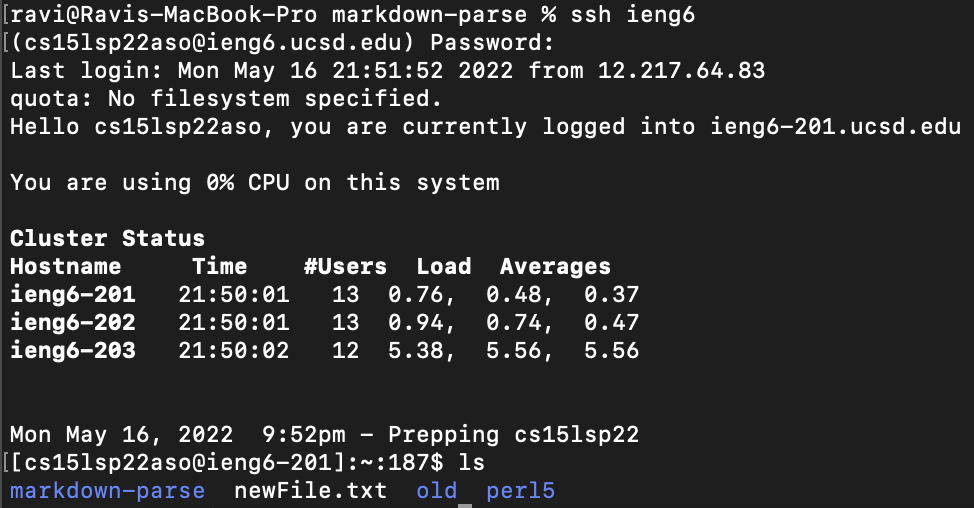
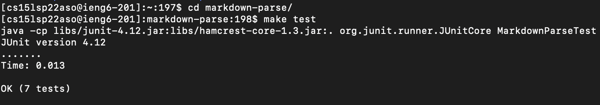
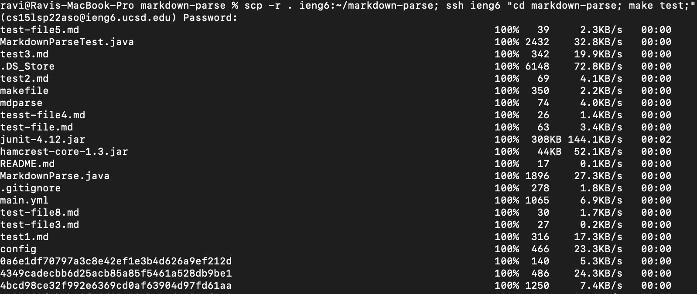
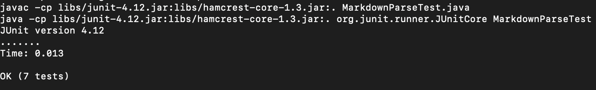

[Home](../index.md)

# Lab Report 3

### Streamlining ssh Configuration

* First, I created and then put in the code for my config file, using:
 `touch` to create the file, `vim` to edit the new file, and `cat` to show it.

* Here's the file with adding the code with `vim`

* Here's the commands run to modify the file and then show that it is saved with the modification. I chose to kept the alias as ieng6 because it's an easy to remember name that tells what server it is.  

* So, with that config file setup, we can now run the following command:

* And then, as you can see, it does the ssh over to the ieng6 server without having to type out the entire username.

* Next, I created a new file on the client side using `touch newFile.txt`. From there, I copied it over to the server side using the following scp command:

* As you can see, the text there that says `newFile.txt` shows that the file got copied over.

* Next, once I ssh over to the server to see the results, it shows that the newFile.txt successfully got transfered over. 

### Setup Github Access from ieng6

### Copy whole directories with scp -r

* By using `scp -r`, we can copy the entire markdown-parse directory over to the ieng6 server. As you can see, when I run the command, it copies everything over. (Picture shows some of the files that were copied over)

* Once this is done, if we ssh back into the server, we can see it successfully copied over the markdown-parse directory.

* Now, if we cd into markdown-parse and try to run the tests using our `make test` command which was set up using a makefile, we can see that it works!

* If we wanted to streamline this whole process to all be done in one line, we can do that too, by combining commands to get the following code:

* Then it continues to copy over a lot more files, and then once that's done, it runs the tests which show that it passes.

