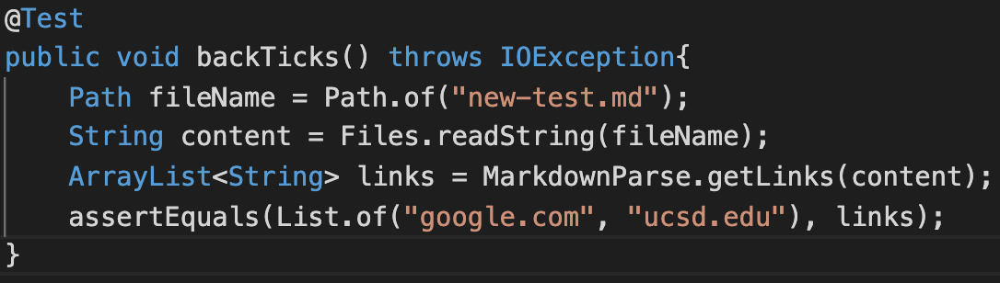
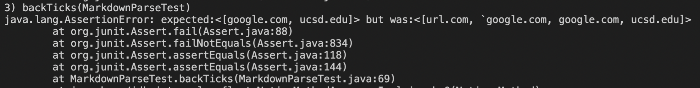
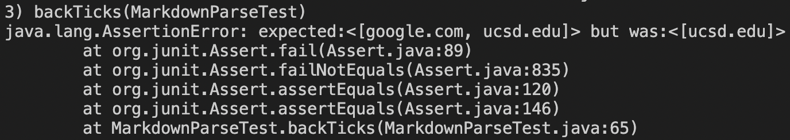
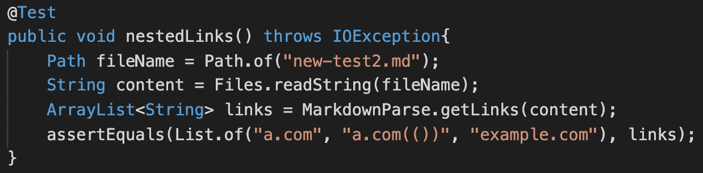
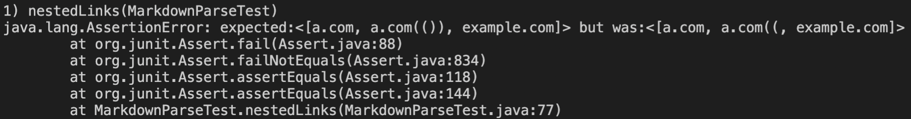
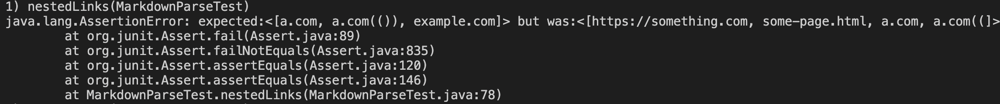
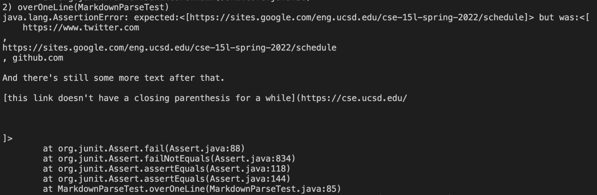
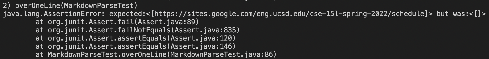

[Home](../index.md)

# Lab Report 4

[My MarkdownParse repo](https://github.com/ravishende/markdown-parser)

[MarkdownParse repo from other group](https://github.com/UDXS/markdown-parser)

# Test 1

expected output: `[google.com, ucsd.edu]`

MarkdownParseTest.java test added:

The output of my MarkdownParse.java: (failed)

The output of the other MarkdownParse.java: (failed)

* I do think that a small code change of less than ten lines would be able to fix this issue, since all you would have to do is:
    if you see a single or triple backtick, change currIndex to be after the corresponding finishing backtick(s) and carry on from there as usual.

# Test 2

expected output: `[a.com, a.com(()), example.com]`

MarkdownParseTest.java test added:

The output of my MarkdownParse.java: (failed)

The output of the other MarkdownParse.java: (failed)

* I don't think that a small code change of less than ten lines would be able to fix this issue.
    It seems like in order to fix this, you would need a separate case for brackets and parenthese, not to mention a condition statement that deals with escaped bracket. In each of the previous cases, you would need to loop through until you find the specific closing character that corresponds to the current opening character, not just the first closing one you find. Then, you also have to deal with the case of not finding a closing character and not staying in a forever loop.

# Test 3

expected output: `[https://sites.google.com/eng.ucsd.edu/cse-15l-spring-2022/schedule]`

MarkdownParseTest.java test added:

The output of my MarkdownParse.java: (failed)

The output of the other MarkdownParse.java: (failed)

* I do think that a small code change of less than ten lines would be able to fix this issue, since all you would have to do is:
    if there isn't an ending bracket or parenthesis on the same line, loop through until there is, and then that is your closing one, however if there is a line break, break the loop and change the closing character index to be negative 1.