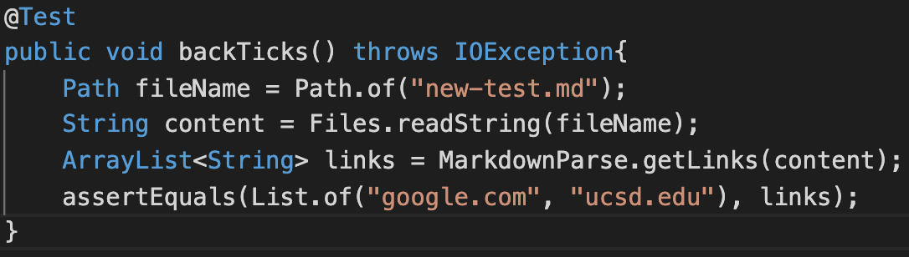
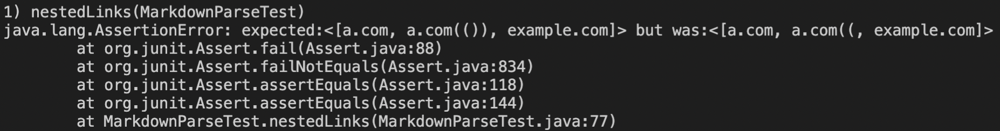
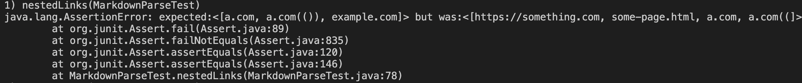
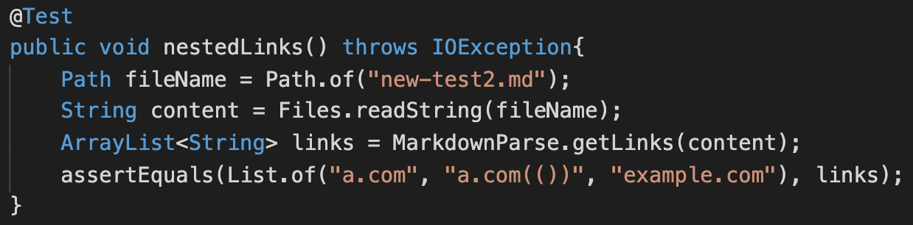
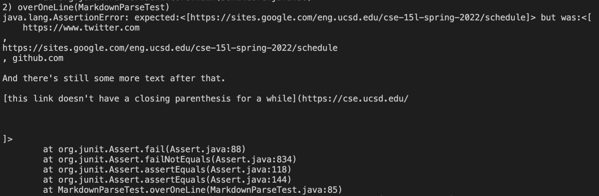
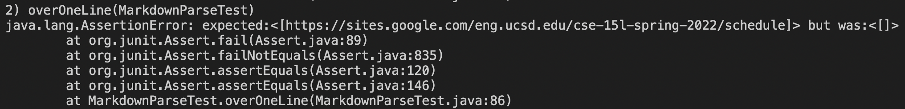
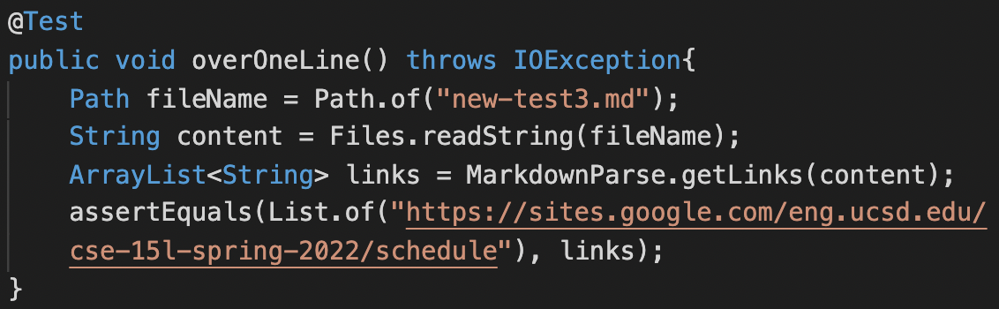
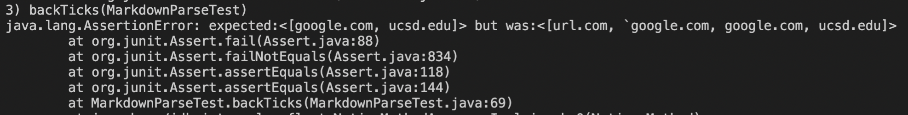
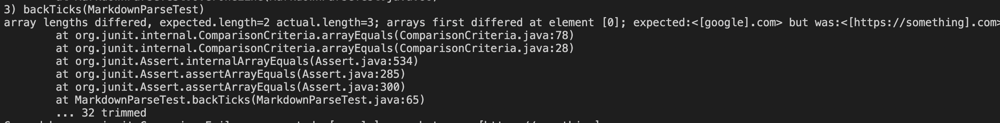

[Home](../index.md)

# Lab Report 4

[MarkdownParse repo](https://github.com/ravishende/markdown-parser)

[MarkdownParse repo from previous week](https://github.com/ravishende/report4-markdown-parser)
*note: I had covid week 7 and therefore could not participate in that lab or do it remotely due to its inherant group nature. So, I am using a version of the markdownParser from week 8 as the other group's mdp instead.

# Test 1

expected output: `[google.com, ucsd.edu]`

MarkdownParseTest.java test added:

The output of my MarkdownParse.java:

The output of the other MarkdownParse.java:

# Test 2

expected output: `[a.com, a.com(()), example.com]`

MarkdownParseTest.java test added:

The output of my MarkdownParse.java:

The output of the other MarkdownParse.java:

# Test 3

expected output: `[https://sites.google.com/eng.ucsd.edu/cse-15l-spring-2022/schedule]`

MarkdownParseTest.java test added:

The output of my MarkdownParse.java:

The output of the other MarkdownParse.java:

