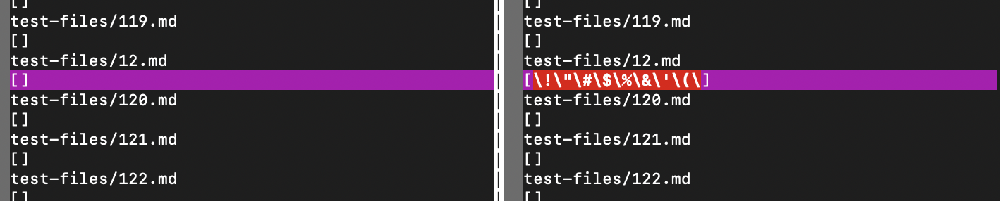
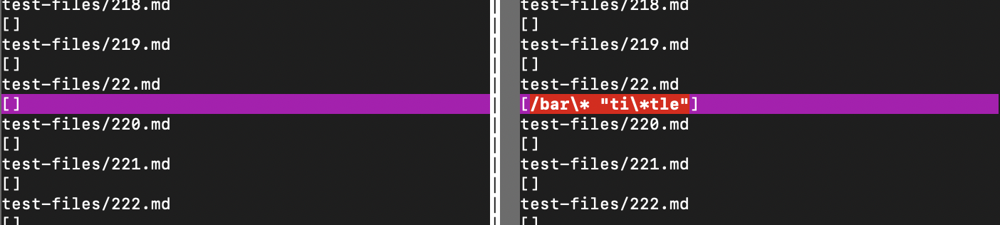
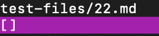
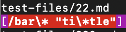

[Home](../index.md)

# Lab Report 5

* I found the differences in tests by first using a for loop in my script.sh to loop through every file and echo its file name then run the MarkdownParse.java file on it. 

* From there, I put those into a new file for each MarkdownParse version called results.txt

* Then I ran vimdiff on it to see where the tests differed. 

Here you can see the vimdiff showing the differences in the tests for test files 12 and 22.

    

## Test 12:

* [test-files/12.md](https://github.com/nidhidhamnani/markdown-parser/blob/main/test-files/12.md?plain=1)

* Expected output: 
`[]`

* My output: 

* Other repository's output: 

* bug:

## Test 22:

* [test-files/22.md](https://github.com/nidhidhamnani/markdown-parser/blob/main/test-files/22.md?plain=1)

* Expected output: 
`[/bar*\]`

* My output: 

* Other repository's output: 

* bug: kldjshglkjshdlkfjhslkjghlkglhjskjlghskljhglskjhglkjshlhgsjkhglkjshdhklj

